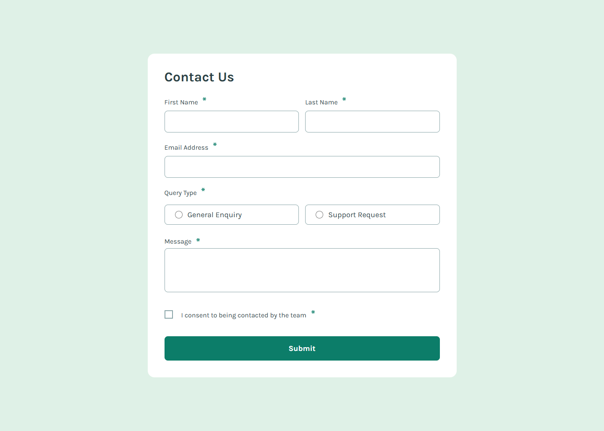
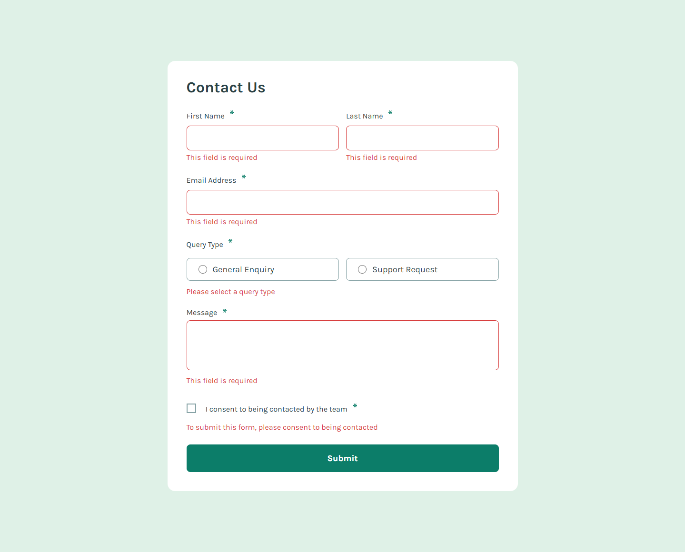
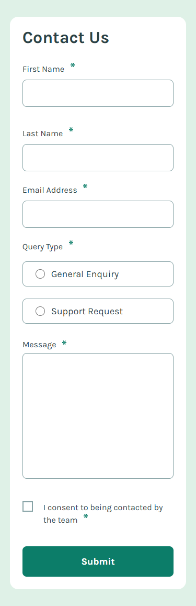

# Frontend Mentor - Contact form solution

This is a solution to the [Contact form challenge on Frontend Mentor](https://www.frontendmentor.io/challenges/contact-form--G-hYlqKJj). Frontend Mentor challenges help you improve your coding skills by building realistic projects.

## Table of contents

| Section                                            | Description                                                    |
| -------------------------------------------------- | -------------------------------------------------------------- |
| [Overview](#-overview)                             | General project information                                    |
| - [The Challenge](#-the-challenge)                 | Problems solved in this project                                |
| - [Screenshots](#-screenshots)                     | Preview of the application                                     |
| - [Links](#-links)                                 | Useful links related to the project                            |
| [My Process](#%EF%B8%8F-my-process)                | Development approach                                           |
| - [Built With](#%EF%B8%8F-built-with)              | Technologies and tools used                                    |
| - [What I learned](#-what-i-learned)               | Some of major learnings while working through this project     |
| - [Continued development](#-continued-development) | Outlining areas to continue to focus on in future projects     |
| - [Useful resources](#-useful-resources)           | Useful resources related to the project                        |
| [Author](#-author)                                 | About the creator of the project                               |
| [Acknowledgments](#%EF%B8%8F-acknowledgments)      | Giving advice to someone who helped bei developing the project |

## 🔍 Overview

### 🎯 The Challenge

Users should be able to:

- ✅ Complete the form and see a success toast message upon successful submission
- ✅ Receive form validation messages if:
  - ✅ A required field has been missed
  - ✅ The email address is not formatted correctly
- ✅ Complete the form only using their keyboard
- ✅ Have inputs, error messages, and the success message announced on their screen reader
- ✅ View the optimal layout for the interface depending on their device's screen size
- ✅ See hover and focus states for all interactive elements on the page

### 📸 Screenshot

_Desktop screenshot_


_Error states_


_Mobile screenshot_


### 🔗 Links

- [Solution URL:](https://www.frontendmentor.io/solutions/accessible-contact-form-Zl5EO5PrNF)
- [Live Site URL:](https://aydankara.github.io/Frontend-Mentor-Challenges/contact-form-main/)

## ⚙️ My Process

### 🏗️ Built With

- ✅ **Semantic HTML5** for accessibility
- ✅ **CSS custom properties** for maintainable styling
- ✅ **Flexbox** for responsive layouts
- ✅ **Vanilla JavaScript** for client-side validation

### 🧠 What I Learned

During this project, i applied best practices in **CSS modularization, JavaScript validation, and accessibility, making the form more maintainable, scalable, and user-friendly**.

♿ Accessibility - Ensuring an Inclusive User Experience
I focused on **making the form accessible** for users who rely on **screen readers and keyboard navigation**:

✅ **Semantic HTML**: Used appropriate `<fieldset>`, `<legend>`, and `<label>` elements to improve usability.
✅ **Aria attributes**:

- `aria-describedby` to link inputs with error messages

- `aria-live="polite"` to ensure **screen readers announce** error messages dynamically

✅ **Keyboard navigation**: Ensured users can complete the form **without a mouse**, using **tab order and focus states**.

Example of an accessible error message implementation:

```html
<input
  type="email"
  id="email"
  name="email"
  autocomplete="email"
  inputmode="email"
  aria-describedby="email-error"
  required
/>
<p class="error-msg" id="email-error" aria-live="polite"></p>
```

✅ `autocomplete="email"`

- Helps browsers **auto-fill** the email field for a better user experience.

✅ `inputmode="email"`

- Suggests an **email-friendly keyboard** on mobile devices (shows "@" and ".com" buttons).

✅ `aria-describedby="email-error"`

- Ensures screen readers **announce** errors when they appear.

✅ `aria-live="polite"` on `.error-msg`

- Ensures error messages are **dynamically read** by screen readers without disrupting the user.

🛠️ **JavaScript - Following DRY Principles & Object-Based Logic**

I structured the JavaScript code to follow the **DRY (Don't Repeat Yourself) principle**, improving code readability and reducing redundancy.

✅ **Reusable functions:** Extracted **repeated logic** into **helper functions**, making validation cleaner and more reusable.
✅ **Object-based logic:** Used an **object to manage validation messages**, making the code easier to modify and extend.
✅ **Pure functions:** Ensured that validation logic **does not mutate global variables**, making debugging simpler.

Example of how i structured the validation logic efficiently:

```javascript
const validations = {
  "first-name": validateRequired,
  "last-name": validateRequired,
  email: validateEmail,
  "query-type": validateQueryType,
  message: validateRequired,
  consent: validateConsent,
};

let isValid = true;

Object.keys(validations).forEach((field) => {
  const fieldIsValid = validations[field](field);
  if (!fieldIsValid) isValid = false;
});

if (isValid) {
  handleFormSuccess();
}
```

This ensures **all validation errors appear at once**, instead of stopping at the first invalid field.

🖌 **Modular CSS for Better Styling**

I structured the CSS in a modular fashion to improve **maintainability and scalability**:

✅ **Better organization:** Each module has a **clear responsibility** (e.g., form styles, validation styles).
✅ **Easier maintenance:** Update or replace parts **without affecting the whole file**.
✅ **Improved readability:** Developers can **quickly find** relevant styles without scanning an entire file.
✅ **Reusability:** Components can be **reused across different projects**, keeping the CSS **efficient**.

### 🔄 Continued Development

🔹 **Improve form validation logic:**: Consider integrating a validation library like **Yup** for scalability.

🔹 **Enhance UX for error messages**: Implement **delayed validation** (only after the user starts typing).

🔹 **Expand accessibility testing**: Use tools like **Lighthouse** to ensure full WCAG compliance.

🔹 **Animations**: Adding subtle animations to improve user experience.

### 📚 Useful Resources

🔗 [**MDN Web Docs**](https://developer.mozilla.org/en-US/docs/Learn_web_development/Extensions/Forms/Form_validation) - Client-side form validation.

🔗 [**WebAIM**](https://webaim.org/) - Web Accessibility Guidelines.

## 👤 Author

💼 Frontend Mentor - [@AydanKara](https://www.frontendmentor.io/profile/AydanKara)

## 🎖️ Acknowledgments

🚀 Huge thanks to the **Frontend Mentor Community** for feedback and resources.

💡 Special thanks to the **web development community** for their invaluable resources on form validation, accessibility, and best practices.
