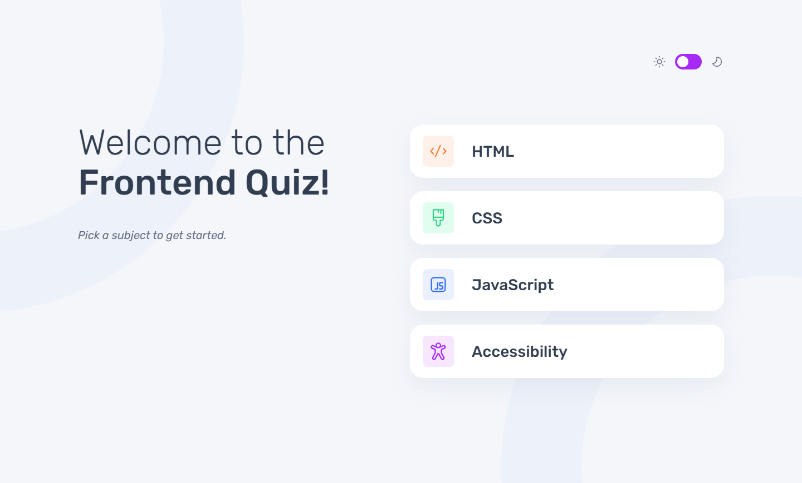
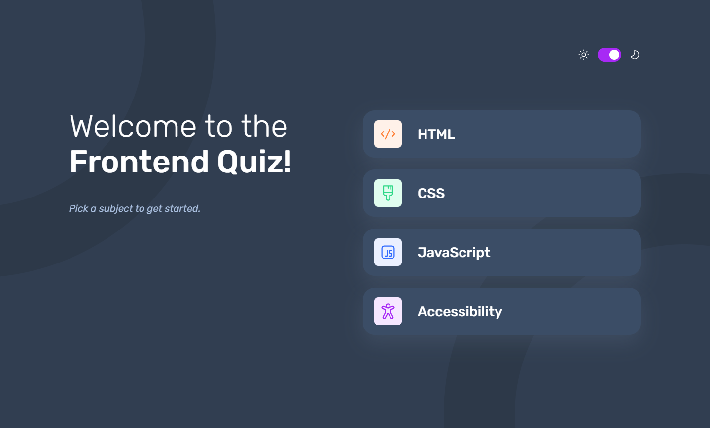

# Frontend Mentor - Frontend quiz app solution

This is a solution to the [Frontend quiz app challenge on Frontend Mentor](https://www.frontendmentor.io/challenges/frontend-quiz-app-BE7xkzXQnU). Frontend Mentor challenges help you improve your coding skills by building realistic projects. 

## Table of contents

| Section | Description |
|---------|-------------|
| [Overview](#-overview) | General project information |
|  - [The Challenge](#-the-challenge) | Problems solved in this project |
|  - [Screenshots](#-screenshots) | Preview of the application |
|  - [Links](#-links) | Useful links related to the project |
| [My Process](#%EF%B8%8F-my-process) | Development approach |
|  - [Built With](#%EF%B8%8F-built-with) | Technologies and tools used |
|  - [What I learned](#-what-i-learned) | Some of major learnings while working through this project |
|  - [Continued development](#-continued-development) | Outlining areas to continue to focus on in future projects |
|  - [Useful resources](#-useful-resources) | Useful resources related to the project
| [Author](#-author) | About the creator of the project |
| [Acknowledgments](#%EF%B8%8F-acknowledgments) | Giving advice to someone who helped bei developing the project |

## 🔍 Overview

### 🎯 The Challenge 

Users should be able to:

- ✅ Select a quiz subject
- ✅ Select a single answer from each question from a choice of four
- ✅ See an error message when trying to submit an answer without making a selection
- ✅ See if they have made a correct or incorrect choice when they submit an answer
- ✅ Move on to the next question after seeing the question result
- ✅ See a completed state with the score after the final question
- ✅ Play again to choose another subject
- ✅ View the optimal layout for the interface depending on their device's screen size
- ✅ See hover and focus states for all interactive elements on the page
- ✅ Navigate the entire app only using their keyboard
- ✅ **Bonus**: Change the app's theme between light and dark

### 📸 Screenshots

*Light Mode*


*Dark Mode*


### 🔗 Links

- 💡 [Solution URL](https://www.frontendmentor.io/solutions/frontend-quiz-app-with-html-css-javascript-Q-t1k1ARNe)
- 🌍 [Live Site URL](https://aydankara.github.io/Frontend-Mentor-Challenges/frontend-quiz-app/src/templates/)

## ⚙️ My Process

### 🏗️ Built With

- ✅ Semantic HTML5
- ✅ CSS custom properties
- ✅ Flexbox & CSS Grid
- ✅ JavaScript (ES6+)
- ✅ Mobile-first workflow
- ✅ Modular JavaScript (separated into multiple files)

### 🧠 What I Learned

📌 **Modularizing JavaScript**
- One of the most important takeaways was splitting the project into **multiple JS files** (`data.js`, `navigation.js`, `quiz.js`, `main.js`). This improved **maintainability and readability**.

📌 **Handling Event Listeners Efficiently**
- I encountered issues with **duplicate event listeners** and solved them by cloning elements before reattaching listeners:
```js
// Replacing button to remove previous event listeners
const newButton = button.cloneNode(true);
button.replaceWith(newButton);
```
📌 **Adding Keyboard Navigation**
- I implemented **keyboard controls** so users could navigate the quiz using **Arrow Keys, Enter, and Spacebar**.

📌 **Implementing Dark Mode Toggle**
- The quiz supports **dark mode**, which is saved in `localStorage`.
```js
themeSwitch.addEventListener("click", () => {
  document.body.classList.toggle("dark-mode");
  localStorage.setItem("theme", document.body.classList.contains("dark-mode") ? "dark" : "light");
});
```

### 🔄 Continued Development

🔹 **State Management**: Consider using a more structured approach, like a **global state** object or a framework like **React**.

🔹 **Unit Testing**: Writing tests for core functions (e.g., `loadQuestion()`, `submitAnswer()`) using **Jest**.

🔹 **Performance Optimization**: Reduce unnecessary DOM manipulations for smoother transitions.

🔹 **Animations**: Adding subtle animations to improve user experience.

### 📚 Useful Resources

🔗 [**MDN Web Docs**](https://developer.mozilla.org/) - Great for understanding JavaScript best practices.

🔗 [**Frontend Mentor Community**](https://www.frontendmentor.io/) - For learning and sharing feedback.

## 👤 Author

💼 Frontend Mentor - [@AydanKara](https://www.frontendmentor.io/profile/AydanKara)

## 🎖️ Acknowledgments

🚀 Huge thanks to the **Frontend Mentor Community** for feedback and resources.

💡 Inspired by similar quiz applications and best practices in modern **JavaScript**.


