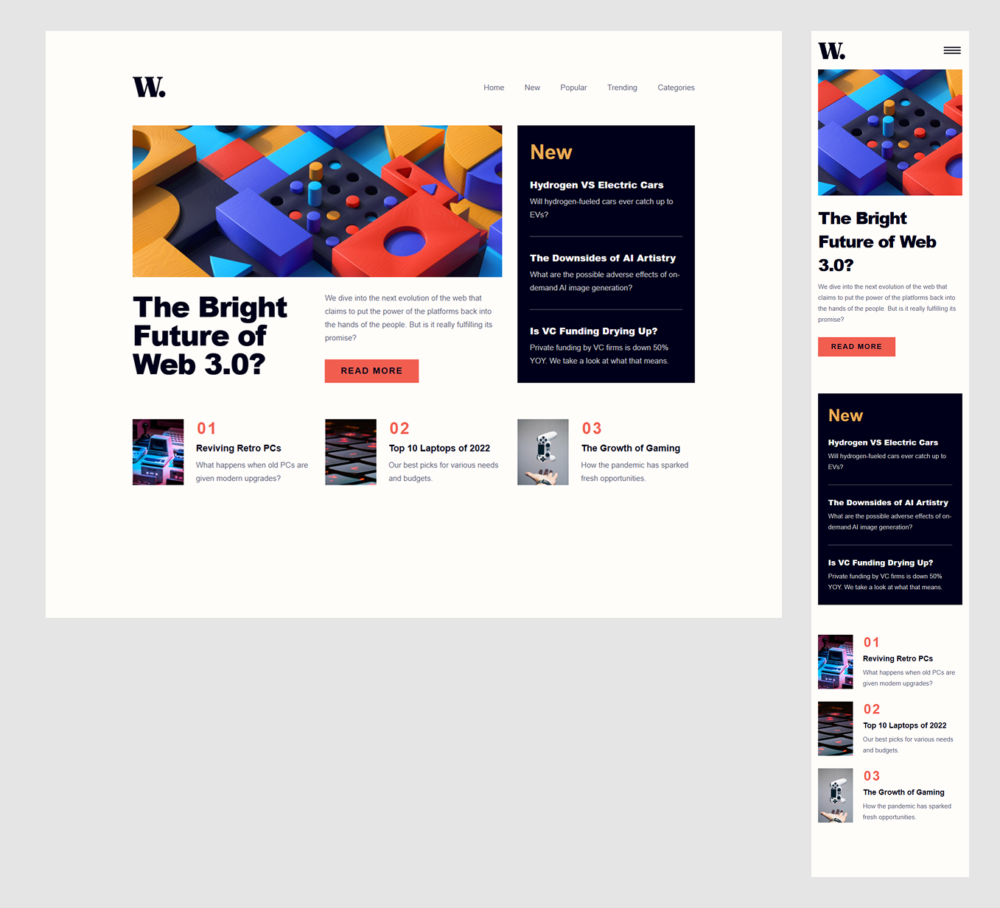

# Frontend Mentor - News homepage solution

This is a solution to the [News homepage challenge on Frontend Mentor](https://www.frontendmentor.io/challenges/news-homepage-H6SWTa1MFl). Frontend Mentor challenges help you improve your coding skills by building realistic projects.

## Table of contents

| Section                                            | Description                                                    |
| -------------------------------------------------- | -------------------------------------------------------------- |
| [Overview](#-overview)                             | General project information                                    |
| - [The Challenge](#-the-challenge)                 | Problems solved in this project                                |
| - [Screenshots](#-screenshots)                     | Preview of the application                                     |
| - [Links](#-links)                                 | Useful links related to the project                            |
| [My Process](#%EF%B8%8F-my-process)                | Development approach                                           |
| - [Built With](#%EF%B8%8F-built-with)              | Technologies and tools used                                    |
| - [What I learned](#-what-i-learned)               | Some of major learnings while working through this project     |
| - [Continued development](#-continued-development) | Outlining areas to continue to focus on in future projects     |
| - [Useful resources](#-useful-resources)           | Useful resources related to the project                        |
| [Author](#-author)                                 | About the creator of the project                               |
| [Acknowledgments](#%EF%B8%8F-acknowledgments)      | Giving advice to someone who helped bei developing the project |

## 🔍 Overview

### 🎯 The Challenge

Users should be able to:

- View the optimal layout for the interface depending on their device's screen size
- See hover and focus states for all interactive elements on the page

### 📸 Screenshots

### 🔗 Links

- 💡 [Solution URL](https://www.frontendmentor.io/solutions/new-solution-for-news-homepage-LXtg5yE7di)
- 🌍 [Live Site URL](https://aydankara.github.io/Frontend-Mentor-Challenges/news-homepage-main/)

## ⚙️ My Process

### 🏗️ Built With

- ✅ Semantic HTML5
- ✅ CSS custom properties
- ✅ Flexbox & CSS Grid
- ✅ JavaScript (ES6+)
- ✅ Mobile-first workflow

### 🧠 What I Learned

This project reinforced several important concepts, including:

🔹 The importance of **CSS modularization** – initially, my CSS grew too large, so i refactored it into **smaller reusable styles**.
🔹 How to implement **ARIA attributes and keyboard navigation** to improve **accessibility**.
🔹 Using **CSS Grid and Flexbox** together for a **fully responsive layout**.
🔹 Handling **mobile navigation** efficiently with **JavaScript event listeners**.

### 🔄 Continued Development

🚀 Future improvements:

🔹 **CSS Refactoring** – Explore **SCSS** for better organization.
🔹 **JavaScript Enhancements** – Consider a framework (e.g., **React**) for complex UI elements.

### 📚 Useful Resources

🔗 [**MDN Web Docs**](https://developer.mozilla.org/) - Great for understanding JavaScript best practices.

🔗 [**Kevin Powell**](https://www.youtube.com/@KevinPowell) - Helping you learn how to make the web, and make it look good while you're at it.

🔗 [**Frontend Mentor Community**](https://www.frontendmentor.io/) - For learning and sharing feedback.

## 👤 Author

💼 Frontend Mentor - [@AydanKara](https://www.frontendmentor.io/profile/AydanKara)

## 🎖️ Acknowledgments

🚀 Huge thanks to the **Frontend Mentor Community** for feedback and resources.
