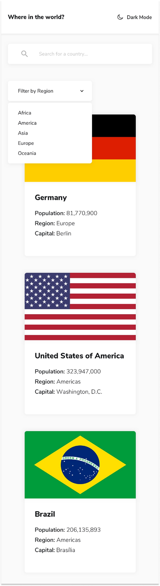

# Frontend Mentor - REST Countries API with color theme switcher solution

This is a solution to the [REST Countries API with color theme switcher challenge on Frontend Mentor](https://www.frontendmentor.io/challenges/rest-countries-api-with-color-theme-switcher-5cacc469fec04111f7b848ca). Frontend Mentor challenges help you improve your coding skills by building realistic projects. 

## Table of Contents

| Section | Subsection | Description |
|---------|------------|-------------|
| [Overview](#overview) |  | General project information |
|  | [The Challenge](#-the-challenge) | Problems solved in this project |
|  | [Screenshots](#-screenshots) | Preview of the application |
|  | [Links](#-links) | Useful links related to the project |
| [My Process](#my-process) |  | Development approach |
|  | [Built With](#%EF%B8%8F-built-with) | Technologies and tools used |
|  | [What I learned](#-what-i-learned) | Some of major learnings while working through this project |
|  | [Continued development](#-continued-development) | Outlining areas to continue to focus on in future projects |
|  | [Useful Resources](#-useful-resources) | References that helped in development |
| [Author](#-author) |  | About the creator of the project |
| [Acknowledgments](#-acknowledgments) | | Giving advice to someone who helped bei developing the project |

## Overview

### 🚀 The Challenge 

👤 Users should be able to:  

- See all countries from the API on the homepage
- Search for a country using an `input` field
- Filter countries by region
- Click on a country to see more detailed information on a separate page
- Click through to the border countries on the detail page
- Toggle the color scheme between light and dark mode *(optional)*

### 📸 Screenshots

#### 🖥️ Desktop View 


#### 📱 Mobile View



#### 🇧🇪 Detail Page


### 🌐 Links

- Solution URL: [Solution URL](https://www.frontendmentor.io/solutions/rest-countries-api-c3arCQFTon)
- Live Site URL: [REST Countries](https://frontend-mentor-challenges-cxu6.vercel.app/)

## My process

### 🛠️ Built With  

#### 🌐 Frontend
  - HTML5 & CSS3 – For semantic markup and responsive styling
  - Flexbox & CSS Grid – For layout structuring
  - Lit-HTML – Lightweight templating library for fast rendering
  - Page.js – Client-side routing for a seamless single-page application
  - REST Countries API – Fetching real-time country data
#### 🎨 UI Components
  - Boxicons – Icon library for UI elements
  - Dark Mode Toggle – Custom implementation using JavaScript

💡 Note: This project does not have a backend. Instead, all data is fetched from the **[REST Countries API](https://restcountries.com/#rest-countries)**.

### 📚 What I Learned
During the development of this project, I deepened my understanding of various frontend concepts, including JavaScript functions, efficient API fetching, and UI improvements. Here are some key takeaways:

#### ⚡ JavaScript Improvements
One of the biggest challenges was handling client-side routing using page.js. Instead of reloading the page on navigation, I learned how to update the content dynamically.

Here's an example of how I used middleware functions to decorate the context before rendering:
```js
const root = document.body;

function decorateContext(ctx, next) {
  ctx.render = renderView;
  next();
}

function renderView(content) {
  render(layoutTemplate(content), root);
}
```
*This ensures that each route automatically updates the page without a full reload.*

#### 🌍 API Handling
Fetching data from the REST Countries API required handling asynchronous requests properly. I learned to use `async/await` with `fetch()`, and how to efficiently process large datasets.
```js
export async function homePage(ctx) {
  const response = await fetch("https://restcountries.com/v3.1/all");
  const countries = await response.json();
  ctx.render(homeTemplate(countries));
}
```

Additionally, I implemented search and filter functionalities to improve the user experience when navigating through countries.

#### 🎨 UI Implementation
I worked on improving user experience (UX) by adding:

  - A search bar with live filtering:
  ```js
  const searchBar = document.getElementById("search-bar");
  const countryName = document.getElementsByClassName("country-name");

  searchBar.addEventListener("input", () => {
    Array.from(countryName).forEach((country) => {
    if (country.innerText.toLowerCase().includes(searchBar.value.toLowerCase())) {
      country.parentElement.parentElement.style.display = "grid";
    } else {
      country.parentElement.parentElement.style.display = "none";
      }
    });
  });
  ```
  - A dark mode toggle that applies theme changes dynamically using JavaScript and CSS classes.

By implementing these features, I strengthened my skills in frontend performance optimization, event handling, and client-side routing. 🚀

### 🔄 Continued Development
There are several areas I want to improve and expand upon in future projects:

#### 🏗️ Enhancing Client-Side Routing
  - Right now, I'm using page.js for client-side navigation. In future projects, I want to explore using React Router or other modern frameworks to manage routes more efficiently.
#### ⚡ Performance Optimization
  - Fetching data from the REST Countries API works well, but I want to implement pagination or lazy loading to improve performance when handling large datasets.
  - Implementing localStorage caching so users don't have to re-fetch data on page reload.
#### 🎨 UI/UX Improvements
  - Adding animations and transitions to enhance user experience when filtering/searching for countries.
  - Improving accessibility (a11y) by ensuring keyboard navigation and screen reader compatibility.
#### 🌐 Expanding API Integrations
  - Right now, the project is purely frontend-based, but in the future, I want to integrate additional APIs to display real-time weather information for each country or historical population data.
#### 🚀 Deployment & Hosting
  - I had some challenges with hosting and deploying projects in the past. I plan to practice using Netlify, Vercel, and GitHub Pages to ensure smooth deployments.

By continuing to refine these areas, I hope to build more advanced and interactive projects in the future! 🚀

### 📚 Useful Resources
Here are some valuable resources that helped me during the development of this project:

  - 🌍 [REST Countries API](https://restcountries.com/#rest-countries) - The official API used in this project to fetch country data.
  - 📖 [Page.js Documentation](https://www.npmjs.com/package/page.js/v/4.13.3) - Helped me understand and implement client-side routing in a simple and lightweight way.
  - ✨ [LitHTML Guide](https://lit.dev/) - A powerful templating library that made it easier to create dynamic UI components.
  - 🎓 [SoftUni](https://softuni.bg/) - The project was prepared during my studies at SoftUni, Bulgaria’s leading IT education institution.
These resources were crucial in solving challenges throughout the project. I highly recommend them for anyone working on similar projects! 🚀

## 👨‍🎨 Author

- Website - [Aydan Karamehmed](https://github.com/AydanKara)
- Frontend Mentor - [@AydanKara](https://www.frontendmentor.io/profile/AydanKara)

## 🙏 Acknowledgments
I would like to express my gratitude to everyone who contributed to my learning and helped me complete this project:

  - Frontend Mentor - For providing such a great challenge that helped improve my frontend development skills.
  - SoftUni - For equipping me with the necessary knowledge and skills to tackle real-world projects.
  - The creators of Page.js and LitHTML - For developing such amazing libraries that made routing and templating much easier.
  - The Developer Community - Special thanks to the open-source community and forums like Stack Overflow, which were incredibly helpful when debugging issues.

This project would not have been possible without the support and knowledge shared by these amazing resources and individuals! 🚀🎉
